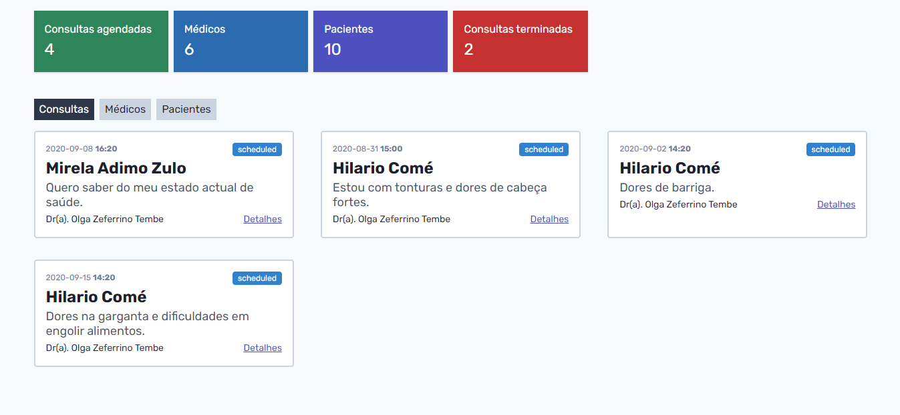
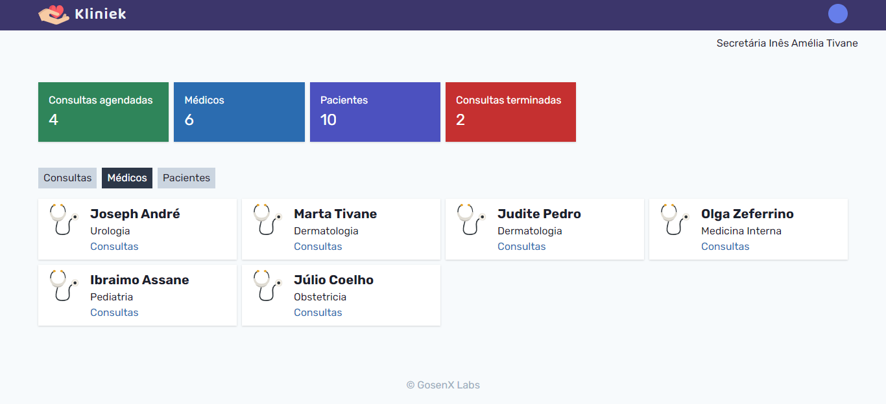
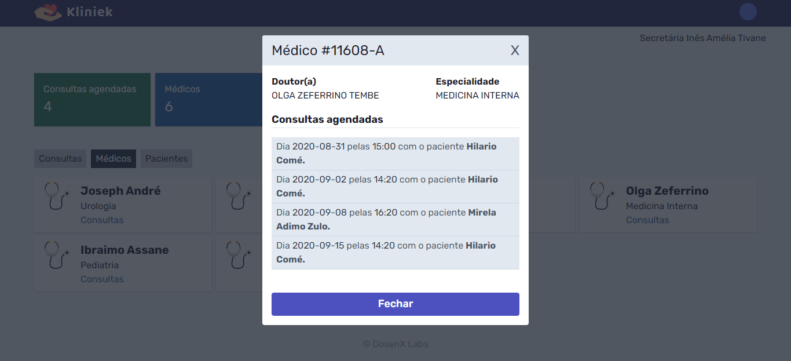
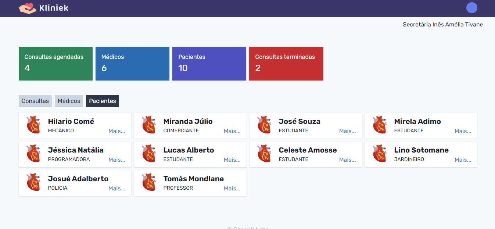
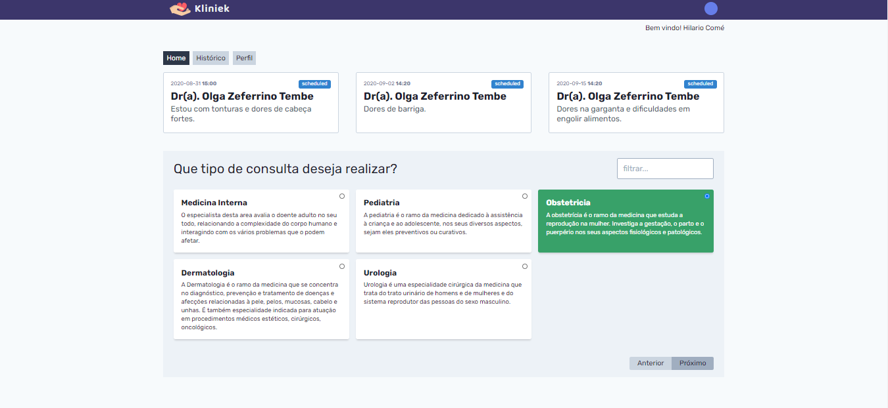
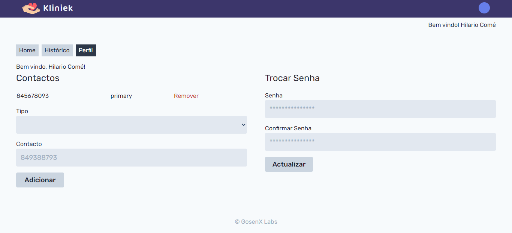
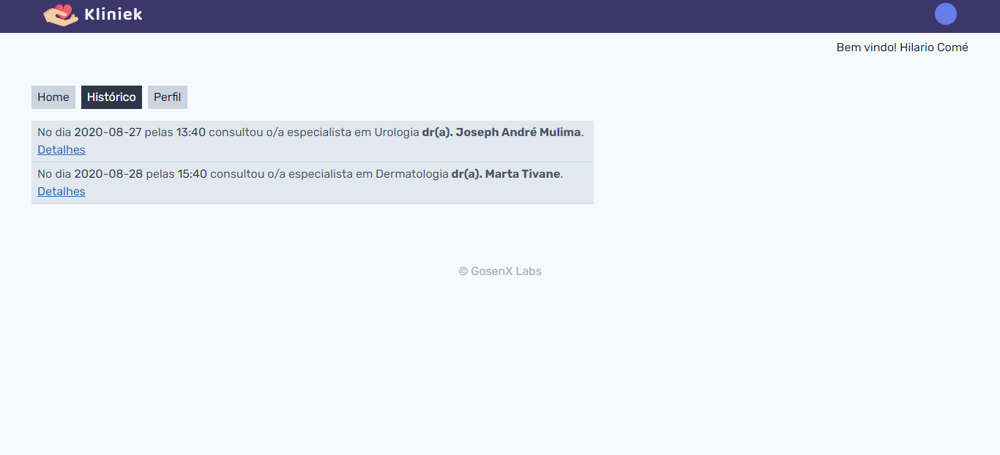

Some of the UIs i built for this project. All the design issues are on me and the credits as well 😅.

- All scheduled appontments

- All the doctors

- Doctor's scheduled appointments

- All the patients

- Doctor prescribing an appointment

- Patient's home page

- Update profile data

- Patients historical

